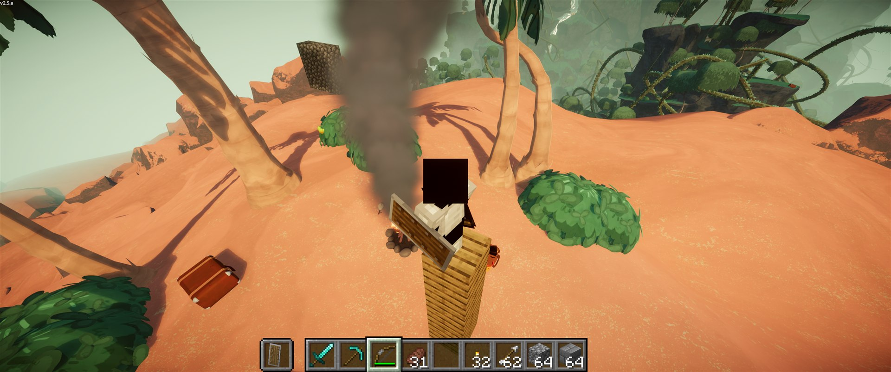
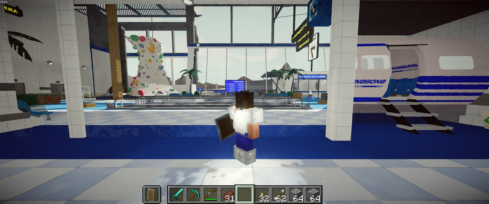
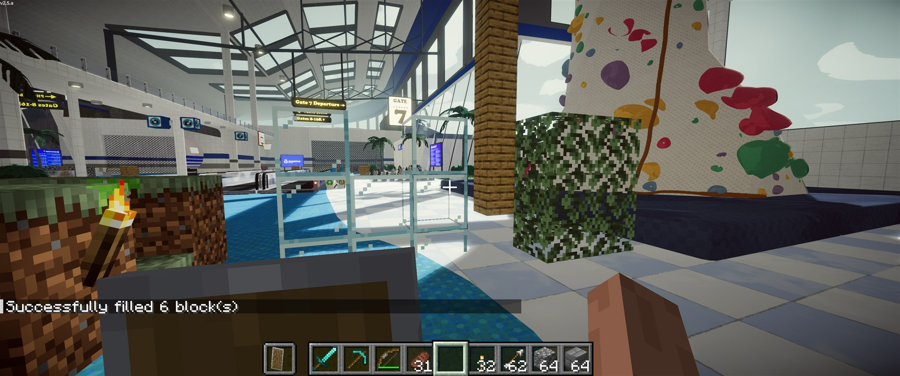

# PeakCraft



Play [PEAK](https://store.steampowered.com/app/3527290/PEAK/) as a Minecraft player. You move with
Minecraft's physics on PEAK's mountain, carry Minecraft's inventory and HUD, and place and break
blocks that PEAK draws in its own world.

PeakCraft is a port of **[SkyCraft](https://github.com/chasmlol/SkyCraft) by
[chasmlol](https://github.com/chasmlol)** (Minecraft inside Skyrim) to PEAK. Neither game is
rewritten: Minecraft runs its own game logic hidden in the background, PEAK runs its airport,
island, fog and campfires, and two small mods talk through shared memory.

> **Experimental, solo only.** A fan project. It isn't affiliated with Mojang, Microsoft, Landfall,
> Aggro Crab, Bethesda or ZeniMax, and you need to own both games.

| | |
|---|---|
|  |  |
| Your Minecraft skin, armour and held items in PEAK | Blocks lit and shadowed by PEAK |

## What works

- **Movement:** walk, sprint, jump, sneak, fall and fly (Creative) with real Minecraft physics on
  PEAK's terrain and buildings. Sneaking stops you at the edge of PEAK's ledges.
- **Camera:** first person and both F5 third-person views. PEAK's mirrors show your Minecraft
  body, animated, in first person too.
- **HUD:** Minecraft's hotbar, hearts, chat, inventory and every other Minecraft screen, over
  PEAK's picture.
- **Blocks:** place and break blocks anywhere. They are hidden by PEAK's rocks in front of them and
  lit by PEAK's sun. Arrows, dropped items, torches, chests and particles show too.
- **PEAK's run:** the kiosk, the flight, the crash on the beach, luggage, campfires, and the rising
  fog all work, through one interact key (G). The summit ending is not reachable yet: it needs a
  PEAK flare, and PEAK's items cannot be used while Minecraft has the body.
- **Survival:** the world starts in Creative, where nothing on the mountain hurts you.
  `/gamemode survival` makes PEAK's hazards cost Minecraft hearts, and a Minecraft death kills
  your scout.
- **Safe fallback:** if Minecraft closes or hangs, PEAK gives you its own controls, camera and HUD
  back within a few seconds, and links again when Minecraft returns.

## Installing and playing

Requirements, install steps, controls and the full list of known limitations are in
**[peak/README.md](peak/README.md)**, which is also the README of the mod package. In short:

1. Build the package (below) and install it into a BepInEx profile for PEAK.
2. Put `skycraft-<version>.jar` in the `mods` folder of your own Minecraft 26.3 Fabric instance and
   add `--enable-native-access=ALL-UNNAMED` to its JVM arguments.
3. Start Minecraft and leave it on the title screen, then start PEAK and begin a solo game.

There is no published release yet; build from source.

| Key | Does |
|---|---|
| **G** | PEAK interact: kiosk, luggage, campfire, items |
| **Esc** | PEAK's pause menu (or closes an open Minecraft screen) |
| **O** | Minecraft's pause / options menu |
| everything else | Minecraft's |

## Building from source

You need the .NET SDK 10 and JDK 25, on Windows.

```sh
cd fabric && gradlew build            # writes fabric/build/libs/skycraft-<version>.jar
dotnet build peak -c Release          # writes peak/artifacts/thunderstore/release/*.zip
```

Copy `peak/Config.Build.user.props.template` to `peak/Config.Build.user.props` if PEAK or your
BepInEx profile are not in the default places.

## How it fits together

| Folder | |
|---|---|
| `peak/` | The PEAK host plugin (C#, BepInEx 5, HarmonyX). New in PeakCraft |
| `fabric/` | The Minecraft Fabric mod (Java). SkyCraft's, with four small changes |
| `protocol/` | The shared-memory layout both sides follow. SkyCraft's, unchanged |
| `skse/` | SkyCraft's Skyrim plugin (C++). Unchanged and not used by PeakCraft; kept so the fork can still build SkyCraft (for the Skyrim host run Minecraft with `-Dskycraft.firstPersonAvatar=false`; the world now starts in Creative with digging off) |
| `tools/` | Packaging, launch scripts and test stand-ins (`fake_minecraft.py`, `fake_skyrim.py`) |

## Documentation

| Document | What it is |
|---|---|
| [docs/PORTING-GUIDE.md](docs/PORTING-GUIDE.md) | How to build a host plugin like this for another game: the link, ownership, collision, camera, input, drawing, damage, testing. Game-agnostic |
| [docs/DESIGN.md](docs/DESIGN.md) | SkyCraft's original design document |
| [docs/PEAK-NOTES.md](docs/PEAK-NOTES.md) | Every PEAK class the plugin touches, patch points and measured facts |
| [docs/PEAKCRAFT-PROGRESS.md](docs/PEAKCRAFT-PROGRESS.md) | What was verified for each part of the port, and how |
| [docs/2026-10-02-001-feat-peakcraft-plan.md](docs/2026-10-02-001-feat-peakcraft-plan.md) | The implementation plan the port followed |
| [docs/solutions/](docs/solutions/) | Short write-ups of problems solved, with YAML frontmatter (`module`, `tags`, `problem_type`) for searching |
| [CONCEPTS.md](CONCEPTS.md) | The project's vocabulary: guest, host, link, ownership and so on |

## Credits

- **[SkyCraft](https://github.com/chasmlol/SkyCraft) by [chasmlol](https://github.com/chasmlol)**
  is the original project. The Minecraft mod, the protocol, the two-game design and most of the
  ideas in the porting guide are SkyCraft's. This repository keeps SkyCraft's full history.
- PeakCraft adds the PEAK host plugin and four changes in the Minecraft mod: the mirror world
  starts in Creative, digging is off by default, sneaking stops at the edges of the host's ground,
  and the player's model is sent in first person too so mirrors can show it.
- The plugin is built on [BepInEx](https://github.com/BepInEx/BepInEx),
  [HarmonyX](https://github.com/BepInEx/HarmonyX) and the
  [PEAK modding template](https://github.com/PEAKModding/BepInExTemplate). Third-party notices for
  SkyCraft's own dependencies are in [THIRD-PARTY-NOTICES.md](THIRD-PARTY-NOTICES.md).

## License

[MIT](LICENSE), like SkyCraft. Copyright for SkyCraft remains with chasmlol.
