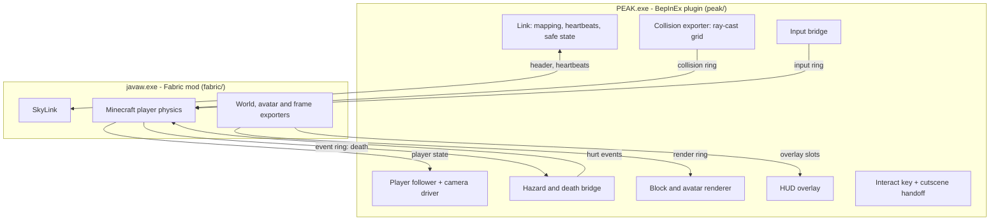
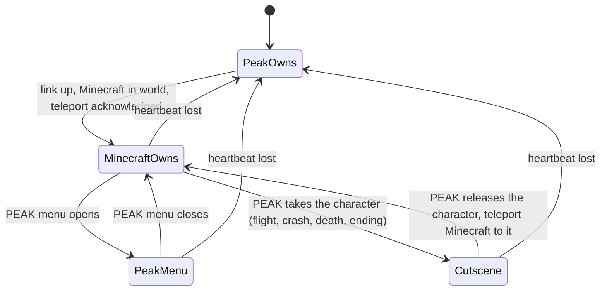

# PeakCraft - Plan

## Goal Capsule

- **Objective:** Play PEAK as a Minecraft player. Port SkyCraft (`https://github.com/chasmlol/SkyCraft`) from Skyrim to PEAK by keeping its Minecraft half and link protocol and replacing its Skyrim half with a BepInEx plugin.
- **Product authority:** The user (solo hobby project, fun experiment). SkyCraft's `README.md`, `docs/DESIGN.md` and `protocol/skycraft_protocol.h` are the reference for architecture, build order and simplicity.
- **Execution profile:** One agent session on the user's Windows PC, intended as a oneshot. The agent builds, launches both games, reads logs and iterates on its own.
- **Authority order:** Product Contract, then Planning Contract, then SkyCraft's source as the pattern to mirror. Where PEAK's real code contradicts an assumption here, the decompile wins and the agent records the change in `docs/PEAK-NOTES.md`.
- **Stop conditions:** Stop and report when a phase cannot be made to run in the real game after reasonable attempts, when a fix would need a Scope Boundary item, or when the Minecraft account, PEAK install or BepInEx is missing.
- **Tail ownership:** The agent builds the Thunderstore zip. The user decides whether to upload.
- **Open blockers:** None. PEAK's class names are resolved by U1 on the PC, not before.

---

## Product Contract

### Summary

PeakCraft is a fork of SkyCraft in which the solo player is a full Minecraft body on PEAK's mountain: Minecraft movement, HUD, inventory, skin and placed blocks, all drawn inside PEAK.
The Minecraft Fabric mod and the shared-memory protocol are reused; the Skyrim SKSE plugin is replaced by a C# BepInEx plugin for PEAK.
The build ends with a Thunderstore-ready zip that is not uploaded.

### Problem Frame

SkyCraft shows that two unmodified games can be joined by two thin translating mods and a shared-memory link, and that an agent can build this with few tests by following a strict phase order.
Its Skyrim half is about 10k lines of C++ built on reverse-engineered headers, Havok shape decoding and a hand-written D3D11 renderer.
PEAK is Unity 6 on Mono with URP, so the same host duties (export collision, puppet the player, draw Minecraft's meshes, overlay the HUD) are available through managed C# and the engine's own renderer.
The user plays PEAK, not Skyrim, and wants the same experience there with the least new design.

### Key Decisions

- **Fork, do not rewrite.** Keep SkyCraft's `fabric/`, `protocol/` and `tools/` and add a PEAK host plugin beside them. SkyCraft is MIT-licensed. The protocol is already host-neutral: Minecraft coordinates, opaque world and actor ids.
- **Core principle carried over.** Neither game is rewritten. If the plugin re-implements a Minecraft mechanic in C#, or the Fabric mod re-implements a PEAK mechanic in Java, the design has gone wrong.
- **Minecraft owns the body everywhere.** PEAK's ragdoll movement, climbing and stamina are off from the airport onward. PEAK is reached through one interact key, as SkyCraft does with Skyrim's activate key.
- **Creative first, Survival by toggle.** The mirror world is a void, so there is no block source. The player starts in Creative; `/gamemode survival` makes PEAK's hazards real.
- **Manual Minecraft start.** The user starts the Minecraft instance; it waits and links when PEAK loads. No bundled launcher.
- **Solo only.** No Photon work and no shared Minecraft world.
- **Few tests, as in SkyCraft.** Verification is the agent running the games and reading logs, plus stand-in scripts. No test suite is a goal.

### Requirements

**Link**

- R1. The PEAK plugin creates the shared-memory mapping and the Fabric mod opens it, with heartbeats in both directions.
- R2. When either side stops, the other drops to a safe state: PEAK returns the body to the player, Minecraft pauses.
- R3. The Fabric mod changes only in the two switches PEAK needs: default game mode and digging off. Dormant Skyrim features stay in place and its link layout stays compatible with `protocol/skycraft_protocol.h`.

**Movement and camera**

- R4. Minecraft physics drives the player on PEAK's collision: walk, sprint, jump, sneak, fall, and Creative flight.
- R5. PEAK's own character movement, climbing and stamina do not act on the player while the link is up.
- R6. PEAK's camera follows Minecraft's camera each frame, including first person and both F5 third-person modes.
- R7. In third person the Minecraft skin is drawn at the player's position and PEAK's character model is hidden.
- R8. One Minecraft block equals one PEAK metre unless decompilation shows the player's height needs a different scale.

**Input**

- R9. PEAK's window keeps focus and all gameplay input goes to Minecraft.
- R10. A dedicated key triggers PEAK's interact on whatever PEAK would target: airport kiosk, campfire, luggage.
- R11. Esc opens PEAK's menu. A second key opens Minecraft's pause menu.
- R12. While a PEAK menu is open, Minecraft receives no input and releases held keys.

**HUD and blocks**

- R13. Minecraft's HUD and every open Minecraft screen are drawn over PEAK's picture at PEAK's resolution.
- R14. PEAK's stamina bar and item HUD are hidden while the link is up.
- R15. Blocks placed in Minecraft appear in PEAK at the matching position, are hidden by PEAK geometry in front of them, and take PEAK's lighting and fog.
- R16. The player collides with placed blocks and with PEAK's world at once.
- R17. Breaking a placed block removes it from PEAK's picture.

**Hazards and death**

- R18. In Survival, PEAK's hazards damage the Minecraft player: cold, heat, poison, thorns, lava and the rising fog.
- R19. Minecraft health is the only health. PEAK's afflictions, hunger and weight are ignored.
- R20. A Minecraft death in Survival kills the PEAK character and PEAK's normal death flow runs.
- R21. In Creative no PEAK hazard harms the player.

**PEAK run logic**

- R22. PEAK's own run runs untouched: airport, flight, crash, campfire checkpoints, rising fog, summit ending.
- R23. A full solo run from airport to island is reachable using only Minecraft movement and the interact key.

**Packaging**

- R24. The build produces a zip that passes Thunderstore's package rules for the PEAK community: `manifest.json`, `README.md`, a 256x256 `icon.png`, and the plugin with the Fabric jar under `plugins/`.
- R25. The package depends on `BepInEx-BepInExPack_PEAK-5.4.75301` and is not uploaded.
- R26. The README tells a player how to set up the Minecraft instance and which keys belong to PEAK.

### Key Flows

- F1. Start of session
  - **Trigger:** User starts the Minecraft instance, then PEAK.
  - **Steps:** Minecraft opens its mirror world hidden and waits. PEAK loads the airport. The plugin creates the link and Minecraft takes the body.
  - **Outcome:** Player stands in the airport with the Minecraft HUD, in Creative.
  - **Covered by:** R1, R4, R9, R13
- F2. Airport to island
  - **Trigger:** Player walks to the kiosk.
  - **Steps:** Interact key starts the run. PEAK plays the flight and crash. Minecraft is teleported to the landing spot when PEAK hands the character back.
  - **Outcome:** Player is on the beach under Minecraft control.
  - **Covered by:** R10, R22, R23
- F3. Build up the mountain
  - **Trigger:** Player places blocks against PEAK's terrain.
  - **Steps:** Minecraft places the block. The plugin draws it in PEAK. The player stands on it.
  - **Outcome:** Blocks and mountain read as one world.
  - **Covered by:** R15, R16, R17
- F4. Survival toggle
  - **Trigger:** Player runs `/gamemode survival`.
  - **Steps:** PEAK hazards start producing Minecraft damage. Death in Minecraft kills the PEAK character.
  - **Outcome:** The climb has stakes; `/gamemode creative` removes them again.
  - **Covered by:** R18, R19, R20, R21
- F5. Link loss
  - **Trigger:** Minecraft closes or stops responding.
  - **Steps:** The plugin sees the heartbeat stop and restores PEAK's own movement, camera and HUD.
  - **Outcome:** The player can keep playing plain PEAK without restarting.
  - **Covered by:** R2

### Acceptance Examples

- AE1. **Covers R18, R21.** Given the player stands in the fog in Creative, when a minute passes, then Minecraft health is unchanged. Given the same spot in Survival, then hearts drop.
- AE2. **Covers R12.** Given the player holds W, when Esc opens PEAK's menu, then the Minecraft player stops walking and stays stopped until the menu closes.
- AE3. **Covers R15.** Given a block placed behind a PEAK boulder, when viewed from the front of the boulder, then the block is not visible.
- AE4. **Covers R2.** Given a linked session on the island, when the Minecraft process is killed, then within about ten seconds PEAK's own character control and stamina bar return.
- AE5. **Covers R20.** Given Survival, when the player falls far enough to die in Minecraft, then PEAK shows its death state for the character.

### Build Order

Each phase ends in something playable, as in SkyCraft's design doc. The agent does not start a phase until the previous one runs in the real game.

| # | Phase | Done when |
|---|---|---|
| 0 | Decompile and link | PEAK's movement, camera, input and interact classes are identified. Both mods handshake and log heartbeats. |
| 1 | Walk | Minecraft movement on PEAK collision in the airport, camera and input bridged, PEAK movement off. |
| 2 | Overlay | Minecraft HUD and inventory screen visible and usable over PEAK. |
| 3 | Interact and run | Interact key works the kiosk; a run reaches the island under Minecraft control. |
| 4 | Blocks | Placed blocks drawn in PEAK with depth and lighting; skin drawn in third person. |
| 5 | Hazards | Survival damage bridge and death. |
| 6 | Package | Thunderstore zip and README. |

### Scope Boundaries

- Multiplayer of any kind, including friends seeing the player.
- Digging the mountain, whether real holes or block drops.
- Water and lava flowing over PEAK terrain, block lights lighting PEAK, block entities such as chests and beds, explosions cratering the mountain.
- PEAK items, stamina or hunger crossing into Minecraft.
- NPC proxies and combat. SkyCraft's actor table stays empty.
- Auto-launching Minecraft and bundling a launcher.
- Uploading to Thunderstore.
- macOS and Linux.

### Dependencies / Assumptions

- The agent session runs on a Windows PC with PEAK, BepInExPack_PEAK, .NET SDK 10, JDK 25 and a Minecraft 26.3 Fabric instance installed.
- The user signs into Minecraft once before the run and allows the agent to launch both games and read their logs.
- The development Minecraft instance runs with JVM arguments `--enable-native-access=ALL-UNNAMED -Dskycraft.quitWithSkyrim=false -Dskycraft.showWindow=true`. Without them Minecraft saves and quits a few seconds after every PEAK restart or stand-in exit.
- PEAK facts from research, not from a decompile: Unity 6 (6000.3.x), URP, Mono, `netstandard2.1`, BepInEx 5.4.23.3, Photon PUN.
- BepInEx cannot compile shaders. The block renderer needs either a material already in the game or a prebuilt shader bundle. Unverified which is available.
- PEAK's collision meshes may not be readable at runtime. If not, collision comes from ray casts on a grid, which SkyCraft's design names as its stage A.
- PEAK's character is a physics ragdoll. Puppeting it is the largest unknown and may require hiding it and moving only a proxy.

### Outstanding Questions

**Deferred to Planning**

- Which PEAK classes own movement, camera, input, interact, afflictions and death, and where to patch them.
- Whether collision is read from mesh data or sampled by ray casts.
- Which key is PEAK interact and which opens Minecraft's menu, given PEAK's default bindings.
- How the plugin learns that PEAK has taken the character for a cutscene (flight, crash) and when to hand it back.
- Whether the fog and other hazards are read from PEAK's affliction values or from their sources.
- Where Minecraft's respawned player goes after a Survival death ends PEAK's solo run, and when the plugin takes ownership again.

### Sources / Research

- SkyCraft: `https://github.com/chasmlol/SkyCraft` — `README.md`, `docs/DESIGN.md` (phase plan in section 12, risks in section 14), `protocol/skycraft_protocol.h`, `tools/fake_skyrim.py`.
- PEAK mod template: `https://github.com/PEAKModding/BepInExTemplate` — `dotnet new peakmod`, Thunderstore packaging built in.
- PEAKLib: `https://github.com/PEAKModding/PEAKLib` — confirms `Character.localCharacter`, `CharacterAfflictions`, Photon PUN, bundle loading.
- PEAK modding wiki: `https://peak.modding-community.com/` — Unity project setup (6000.3.15f1, URP), packaging and publishing.
- Thunderstore package format: `https://wiki.thunderstore.io/mods/creating-a-package`.
- BepInExPack_PEAK: `https://thunderstore.io/c/peak/p/BepInEx/BepInExPack_PEAK/`.

---

## Planning Contract

Product Contract preservation: changed: R3 — reworded to name the two Fabric switches the plan makes, a clarification of the same intent.

**Target repo:** a fork of `https://github.com/chasmlol/SkyCraft`, cloned on the Windows PC. All paths below are relative to that fork's root.

### Key Technical Decisions

- KTD1. **Fork layout: add `peak/`, leave `skse/` alone.** The PEAK host lives in a new `peak/` folder beside `fabric/`, `protocol/` and `tools/`. Skyrim code stays untouched so upstream SkyCraft changes still merge.
- KTD2. **Plugin starts from the PEAK template.** Scaffold with `dotnet new peakmod`, which targets `netstandard2.1`, references the game's assemblies from the install folder and has Thunderstore packaging built in. Patches use Harmony, which BepInEx ships.
- KTD3. **The protocol is frozen.** The plugin creates the mapping with the same name, magic, version and offsets as `protocol/skycraft_protocol.h`. A C# mirror of the layout sits in the plugin and a startup self-check logs pass or fail for every struct size and offset.
- KTD4. **Minecraft-side edits are two switches.** Creative as the mirror world's default game mode, and digging off by default. Mod id, package names and dormant Skyrim features (actor proxies, skill training, dig) are left as they are. Hazard scaling lives in the plugin.
- KTD5. **One block is one Unity unit; the host converts.** The protocol carries Minecraft coordinates only, so all conversion lives in the plugin. Unity is left-handed and Minecraft right-handed, so one horizontal axis flips. The exact sign and yaw offset are pinned by one in-game check. A constant Y offset keeps PEAK's world inside the mirror dimension's build range of -1024 to 1023.
- KTD6. **Collision by ray-cast grid, sent as triangles and occupancy.** The plugin samples PEAK's physics with ray casts on a grid around the player. The Fabric mod's local player, crosshair pick and camera collide with triangle messages only, so the plugin triangulates the hit grid and sends triangles with every region. Occupancy blocks go alongside for the teleport hold, other entities and block support. Reading PEAK's collider meshes directly is the upgrade if they turn out to be readable.
- KTD7. **The PEAK character is a hidden follower, not a driven ragdoll.** The plugin switches off PEAK's movement, climbing and stamina, hides the character's renderers, and places the character at Minecraft's position each frame. PEAK's triggers, fog and campfires keep seeing a character at the right spot.
- KTD8. **Look is integrated by the host.** As in SkyCraft, the plugin turns raw mouse movement into yaw and pitch and publishes them as the authoritative look. Minecraft's camera position, eye height and field of view come back and drive PEAK's camera after PEAK's own camera update.
- KTD9. **Input is read raw and re-encoded.** The plugin reads keyboard and mouse state from Unity, blocks PEAK's own actions, and writes key, button, scroll, cursor and text events to the input ring. Keys are SDL scancodes (USB HID usage ids). Mouse buttons are SDL numbers: 1 left, 2 middle, 3 right, 4 and 5 extra. The PEAK interact key and the Minecraft menu key are BepInEx config entries whose defaults U1 picks from keys unbound in both games.
- KTD10. **HUD is a full-screen texture.** The plugin uploads the newest overlay slot into one texture and draws it over PEAK's final image. Minecraft's inverted crosshair blend is replaced by a plain draw.
- KTD11. **Blocks are Unity meshes with a borrowed material.** The plugin turns each render-ring section into a mesh and the atlas into a texture, and draws them with a material found in PEAK at runtime. The material must multiply vertex colour and support alpha clipping, because tint, ambient occlusion and cutout ride on those. U1 finds a candidate among PEAK's loaded shaders. A prebuilt shader bundle is the fallback if none qualifies.
- KTD12. **Hazards are read as affliction changes.** The plugin accumulates how much PEAK adds to the character's afflictions and resets them each frame so PEAK never incapacitates the character on its own. At most every half second it sends one hurt event for the accumulated amount, because Minecraft discards repeat hits inside that window. The plugin does all scaling: the Fabric mod divides the sent value by 100 and then by 5. Minecraft ignores hurt events in Creative, which gives the Survival toggle for free.
- KTD13. **Safe state is one state variable.** Every patch reads the ownership state and applies the table under the state diagram. Heartbeat loss sets the state to PEAK owns, which restores PEAK's movement, camera, HUD and character visibility together.
- KTD14. **Verification is logs plus stand-ins.** The agent proves each phase by launching the games and reading `BepInEx/LogOutput.log` and Minecraft's `logs/latest.log`. A small fake-Minecraft script proves the link in U2 before real Minecraft is involved, mirroring `tools/fake_skyrim.py`. Every later unit is verified against real Minecraft.

### High-Level Technical Design

Component topology. Solid arrows are shared-memory regions; the plugin owns the mapping.



Who owns the player. The plugin is always in exactly one of these states.



What each state switches on:

| State | PEAK movement | PEAK input | PEAK camera | PEAK HUD | Character shown | Overlay and blocks |
|---|---|---|---|---|---|---|
| PEAK owns | on | on | on | on | yes | off |
| Minecraft owns | off | off | off | off | no | on |
| PEAK menu | off | on | off | on | no | on |
| Cutscene | on | off | on | on | yes | on |

Per-frame order inside the plugin: read Minecraft state, place follower, export collision around the new position, pump input, read hazards, then after PEAK's camera update overwrite the camera, then draw blocks, then draw the overlay last.

### Output Structure

```text
peak/
  PeakCraft.sln
  Directory.Build.props
  Config.Build.user.props.template
  README.md
  CHANGELOG.md
  icon.png
  LICENSE
  src/PeakCraft/
    PeakCraft.csproj
    Plugin.cs            entry point, config, per-frame order
    Link/                mapping, Proto mirror and self-check, seqlocks, rings, heartbeats
    World/               coordinate mapping, collision exporter
    Player/              follower, camera driver, ownership state
    Input/               input bridge, scancode table, interact key
    Render/              overlay, block sections, atlas, avatar
    Hazards/             affliction bridge, death
    Patches/             Harmony patches, one file per PEAK class
docs/PEAK-NOTES.md       decompile findings: classes, methods, patch points
tools/fake_minecraft.py  stand-in for the Fabric mod
```

### Assumptions and Constraints

- The Fabric mod's local player, crosshair pick and camera collide with triangle messages only; occupancy regions serve the teleport hold, other entities and block support. `tools/fake_skyrim.py` sends both for its test floor.
- Minecraft holds the player after a teleport until the regions at and below the feet are known, and a region is known only once a region message for it arrives, even an empty one.
- Minecraft paces its frames on the host state's sequence number, so the plugin writes the host state every PEAK frame.
- The mapping is about 196 MB. If Mono's named memory-mapped file cannot create it, the plugin calls the Win32 mapping functions directly.
- The Fabric mod builds and runs unchanged against Minecraft 26.3 on the PC before any edit is made. U3 proves this with `tools/fake_skyrim.py` first.
- PEAK's camera and character can be overridden after their own update each frame. If PEAK moves them later in the frame, the patch point moves, not the design.
- No commits, pushes or uploads happen unless the user asks.

### Risks

| Risk | Effect | Mitigation |
|---|---|---|
| Ragdoll physics fights the follower | Character jitters or drifts from Minecraft's position | Make the character's bodies kinematic while Minecraft owns the player; if that breaks triggers, move only the root and disable the rest |
| No suitable PEAK material for blocks | Blocks render pink or untextured | Try materials from PEAK's scene, then a built-in URP shader by name; last resort is an unlit vertex-colour material from Unity's built-ins |
| Ray-cast grid misses thin ledges or overhangs | Player falls through or clips | Multi-hit columns for overhangs, finer grid near the player, then exact triangles as the upgrade path |
| PEAK's map streams or regenerates segments | Collision goes stale | Bump the collision epoch on scene or segment change and re-export |
| Full-resolution overlay upload each frame is slow | Frame-rate drop | Upload only when the dirty flag is set; cap overlay at PEAK's resolution |
| PEAK update changes class names | Patches fail to apply | Each patch logs success at startup; a failed patch disables the plugin instead of half-running |
| PEAK anti-tamper or online checks | Unknown | Solo offline only; stop and report if PEAK refuses to run modded |

---

## Implementation Units

| U-ID | Phase | Title | Key files | Depends on |
|---|---|---|---|---|
| U1 | 0 | Fork, scaffold, decompile notes | `peak/`, `docs/PEAK-NOTES.md` | none |
| U2 | 0 | Link and protocol mirror | `peak/src/PeakCraft/Link/`, `tools/fake_minecraft.py` | U1 |
| U3 | 0 | Fabric switches and baseline | `fabric/src/client/java/dev/skycraft/client/MirrorWorld.java` | U1, U2 |
| U4 | 1 | Coordinates and collision export | `peak/src/PeakCraft/World/` | U2, U3 |
| U5 | 1 | Player follower and camera | `peak/src/PeakCraft/Player/` | U2, U4 |
| U6 | 1 | Input bridge and menu state | `peak/src/PeakCraft/Input/` | U5 |
| U7 | 1 | Safe state on link loss | `peak/src/PeakCraft/Player/` | U5, U6 |
| U8 | 2 | HUD overlay | `peak/src/PeakCraft/Render/` | U2 |
| U9 | 3 | Interact key and cutscene handoff | `peak/src/PeakCraft/Input/`, `peak/src/PeakCraft/Player/` | U6 |
| U10 | 4 | Blocks and avatar in PEAK | `peak/src/PeakCraft/Render/` | U5, U8 |
| U11 | 5 | Hazards and death | `peak/src/PeakCraft/Hazards/` | U5 |
| U12 | 6 | Package and README | `peak/README.md`, `peak/icon.png` | all |

### U1. Fork, scaffold, decompile notes

- **Goal:** A buildable empty plugin that loads in PEAK, and a written map of the PEAK classes every later unit patches.
- **Requirements:** Build Order phase 0; resolves the first Outstanding Question.
- **Dependencies:** none
- **Files:** `peak/` scaffold from the template; `peak/Config.Build.user.props.template`; `docs/PEAK-NOTES.md`
- **Approach:** Fork and clone SkyCraft. Scaffold the plugin with the PEAK template into `peak/`. Decompile PEAK's main assembly and record, for each concern, the class, the method to patch and whether to prefix or postfix: local character, movement, climbing, stamina, camera, input actions, interact, afflictions, death, HUD, scene and segment loading, cutscene control. Record the character's height to settle scale, the minimum and maximum world Y of the airport and island scenes, PEAK's default key bindings, and one loaded shader that multiplies vertex colour and supports alpha clipping.
- **Execution note:** Decompile before writing any patch. Every later unit cites `docs/PEAK-NOTES.md` instead of guessing names.
- **Patterns to follow:** `skse/src/main.cpp` for install order; PEAKLib source for how mods reach `Character.localCharacter`.
- **Test scenarios:** Test expectation: none -- scaffolding and notes. Proof is the load line in the log.
- **Verification:** PEAK starts with the plugin and `BepInEx/LogOutput.log` shows its load line. `docs/PEAK-NOTES.md` names a patch point for every concern above or marks it not found.

### U2. Link and protocol mirror

- **Goal:** The plugin creates the shared mapping and exchanges heartbeats with a peer.
- **Requirements:** R1, R3
- **Dependencies:** U1
- **Files:** `peak/src/PeakCraft/Link/Proto.cs`, `peak/src/PeakCraft/Link/Link.cs`, `peak/src/PeakCraft/Link/Rings.cs`, `tools/fake_minecraft.py`
- **Approach:** Mirror every offset, struct size and enum from `protocol/skycraft_protocol.h`. Create the named mapping at plugin start, write the header, and stamp the host heartbeat and host state every frame. Heartbeats use the Win32 tick count and tick timestamps use the Win32 performance counter, matching `SkyLink.java`; the .NET equivalents differ. Drain the event ring every frame and skip event types the plugin does not handle. Implement seqlock read and write for the state slots, the fixed-entry rings for input and events, and the byte rings for collision and render. `tools/fake_minecraft.py` opens the mapping, stamps the guest heartbeat and writes a scripted player state; it does nothing else.
- **Patterns to follow:** `skse/src/Link.cpp`, `fabric/src/main/java/dev/skycraft/link/SkyLink.java`, `tools/fake_skyrim.py`
- **Test scenarios:**
  - Startup self-check: each mirrored struct's size equals the header's `static_assert` value (header 0x20, host state 0x40, guest state 0xC8, input event 16, guest event 32, collision block 80, collision triangle 40, render vertex 32).
  - Startup self-check: each region offset equals the header's constant, including the computed overlay and render ring offsets.
  - Ring write then read returns the same entries across a wrap-around.
  - Integration: with `tools/fake_minecraft.py` running, the plugin logs "link up" and reads the scripted position.
  - Error path: mapping creation fails, the plugin logs the error and disables itself without throwing every frame.
- **Verification:** The self-check logs pass. Plugin and fake Minecraft see each other's heartbeat in the log.

### U3. Fabric switches and baseline

- **Goal:** The Fabric mod builds, runs against the stand-in host unchanged, gains the two switches, and links to the real plugin.
- **Requirements:** R3, R21; Key Decision "Creative first"
- **Dependencies:** U1, U2
- **Files:** `fabric/src/client/java/dev/skycraft/client/MirrorWorld.java`, `fabric/src/main/java/dev/skycraft/world/SkyDig.java`
- **Approach:** Build the mod and run it against `tools/fake_skyrim.py` before editing, to prove the baseline. Then change the mirror world's default game mode to Creative and make digging default to off. Delete the instance's `saves/SkyCraft` world after the baseline run, because the game mode applies only when the world is created. Leave everything else.
- **Execution note:** Baseline run comes first. If the unmodified mod does not run on this PC, stop and fix that before U4 or any later unit.
- **Patterns to follow:** The existing `destruction=` setting in `fabric/src/client/java/dev/skycraft/client/DestructionToggle.java`.
- **Test scenarios:**
  - Baseline: `tools/fake_skyrim.py` reports Minecraft walking its test floor and saves an overlay image.
  - A fresh mirror world opens in Creative.
  - Punching scripted collision does not start a dig.
  - Existing `fabric/src/test/` tests still pass.
- **Verification:** `gradlew build` passes and the stand-in run shows a Creative player on the test floor. With PEAK and the real Minecraft instance both running, each log shows the other side's heartbeat.

### U4. Coordinates and collision export

- **Goal:** Minecraft stands and walks on PEAK's world.
- **Requirements:** R4, R8, R16
- **Dependencies:** U2, U3
- **Files:** `peak/src/PeakCraft/World/Coords.cs`, `peak/src/PeakCraft/World/CollisionExporter.cs`
- **Approach:** Convert positions and angles between Unity and Minecraft space in one place. Publish PEAK's character position with a new teleport sequence so Minecraft starts where PEAK is. Around that position, cast rays down each sub-column of a grid, with repeat hits for overhangs. For every 8-block region in the export volume send a triangle message built by joining neighbouring hits of the same layer, then a region message with its 8x8x8 occupancy masks. Send empty regions too, down to at least one full region below the feet. While PEAK owns the character or a teleport is pending, centre the export on the published position, not on Minecraft's reported one. Amortise over frames and evict far regions. Raise slopes steeper than PEAK's walkable angle into walls, as the design doc describes. Bump the collision epoch on scene change.
- **Technical design:** Directional. Near ring fine and refreshed every few frames; far ring coarse and refreshed slowly; a moved player re-centres the rings on region boundaries.
- **Patterns to follow:** `skse/src/Collision.cpp` for region messages and amortisation; `docs/DESIGN.md` section 5.1.
- **Test scenarios:**
  - In game: with real Minecraft linked, the player comes to rest on the airport floor at the logged height.
  - In game: walking Unity-forward moves Minecraft along the expected axis and sign, and turning right turns Minecraft right.
  - In game: the crosshair can target PEAK's floor.
  - Edge: a teleport onto a spot with open air below is still acknowledged.
  - In game: scene change clears old collision.
- **Verification:** With real Minecraft linked, its logged player Y matches the airport floor height and stays there.

### U5. Player follower and camera

- **Goal:** Minecraft's position and view are what PEAK shows.
- **Requirements:** R4, R5, R6, R7 (hide only), F1
- **Dependencies:** U2, U4
- **Files:** `peak/src/PeakCraft/Player/Ownership.cs`, `peak/src/PeakCraft/Player/Follower.cs`, `peak/src/PeakCraft/Player/CameraDriver.cs`, `peak/src/PeakCraft/Patches/`
- **Approach:** Implement the ownership state machine. On taking ownership, wait for Minecraft to acknowledge the teleport that U4 publishes. While owning, patch out PEAK's movement, climbing and stamina, hide the character's renderers, and place the character at Minecraft's interpolated feet. After PEAK's camera update, set camera position, rotation and field of view from Minecraft's state.
- **Patterns to follow:** `skse/src/Game.cpp` for the puppeting flags and teleport handshake; `Runtime` in `skse/src/Game.h`.
- **Test scenarios:**
  - In game: walking in Minecraft moves PEAK's camera through the airport without PEAK's character model in view.
  - In game: PEAK's stamina does not drain and the character does not ragdoll while owned.
  - Edge: Minecraft not yet in its world, PEAK keeps control.
  - Edge: teleport not acknowledged, PEAK's controls stay frozen rather than drifting.
  - In game: F5 third person moves the camera back without clipping into the hidden character.
- **Verification:** A logged comparison of Minecraft's eye position and PEAK's rendered camera position agrees within a few centimetres while walking.

### U6. Input bridge and menu state

- **Goal:** Keyboard and mouse drive Minecraft while PEAK's window has focus.
- **Requirements:** R9, R11, R12, AE2
- **Dependencies:** U5
- **Files:** `peak/src/PeakCraft/Input/InputBridge.cs`, `peak/src/PeakCraft/Input/Scancodes.cs`
- **Approach:** Each frame, diff raw key and button state and write events to the input ring. Integrate mouse deltas into yaw and pitch using Minecraft's reported sensitivity. When Minecraft reports an open screen, send absolute cursor and text events instead of look. Block PEAK's gameplay actions while owning. Esc goes to PEAK; the configured Minecraft menu key sends the open-menu event. When a PEAK menu opens, send release-all and set the menu flag.
- **Patterns to follow:** `skse/src/Input.cpp`; `fabric/src/client/java/dev/skycraft/client/InputBridge.java` for what each event means.
- **Test scenarios:**
  - In game: letters, digits, modifiers, arrows and function keys reach Minecraft as the right keys, and left, right and middle mouse buttons are not swapped.
  - Covers AE2. Holding W then opening PEAK's menu stops the Minecraft player until the menu closes.
  - Minecraft's log shows the inventory screen opening on E and cursor events arriving.
  - Minecraft's log shows typed chat text arriving intact.
  - Edge: alt-tab away sends release-all.
- **Verification:** Sprint-jumping around the airport works with Minecraft's default keys, and PEAK's own character actions do not fire.

### U7. Safe state on link loss

- **Goal:** Losing Minecraft never strands the player.
- **Requirements:** R2, F5, AE4
- **Dependencies:** U5, U6
- **Files:** `peak/src/PeakCraft/Player/Ownership.cs`, `peak/src/PeakCraft/Link/Link.cs`
- **Approach:** Treat a stale guest heartbeat as link loss. Clear the ownership flag, which un-hides the character, re-enables PEAK movement, camera, input and HUD, and stops drawing overlay and blocks. Re-link when a heartbeat returns.
- **Patterns to follow:** The heartbeat timeout in `fabric/src/main/java/dev/skycraft/link/SkyLink.java`.
- **Test scenarios:**
  - Covers AE4. Killing the Minecraft process returns PEAK control within about ten seconds.
  - Restarting Minecraft afterwards re-links without restarting PEAK.
  - PEAK loading screens do not trigger a false link loss on the Minecraft side.
- **Verification:** Killing and restarting real Minecraft toggles ownership in the log both ways.

### U8. HUD overlay

- **Goal:** Minecraft's HUD and screens are visible over PEAK.
- **Requirements:** R13, R14
- **Dependencies:** U2
- **Files:** `peak/src/PeakCraft/Render/Overlay.cs`
- **Approach:** Publish PEAK's resolution in the host state. When the overlay dirty flag is set, swap slots, upload the pixels to a texture and draw it full-screen after PEAK's UI, honouring the slot's row-order flag and premultiplied alpha. Hide PEAK's stamina and item HUD while owning.
- **Patterns to follow:** `skse/src/Overlay.cpp` for the triple-buffer swap; `fabric/src/client/java/dev/skycraft/client/FrameExporter.java`.
- **Test scenarios:**
  - In game: hotbar, hearts and crosshair appear the right way up and at the right scale.
  - In game: the inventory screen is readable and clickable.
  - Edge: PEAK resolution change resizes the overlay.
  - Edge: no new frame from Minecraft keeps showing the last one, without tearing.
- **Verification:** A screenshot of PEAK shows Minecraft's hotbar and no PEAK stamina bar.

### U9. Interact key and cutscene handoff

- **Goal:** A full solo run reaches the island under Minecraft control.
- **Requirements:** R10, R22, R23, F2
- **Dependencies:** U6
- **Files:** `peak/src/PeakCraft/Input/Interact.cs`, `peak/src/PeakCraft/Player/Ownership.cs`
- **Approach:** On the interact key, call PEAK's own interact on whatever PEAK currently targets from the camera. Detect when PEAK takes the character for the flight, crash, death or ending and enter the cutscene state: stop following and let PEAK's camera show. When PEAK releases the character, teleport Minecraft to it and resume.
- **Patterns to follow:** SkyCraft's handing control to Skyrim for furniture and scripted scenes in `skse/src/Game.cpp`.
- **Test scenarios:**
  - In game: interact at the kiosk starts a run.
  - In game: after the crash, Minecraft's player stands on the beach at PEAK's character position.
  - In game: interact lights or uses a campfire.
  - Edge: interact with nothing targeted does nothing and logs nothing alarming.
  - Edge: scene change during a cutscene clears collision and re-exports.
- **Verification:** Log shows airport, cutscene, island ownership transitions in order, ending in Minecraft owning the player on the island.

### U10. Blocks and avatar in PEAK

- **Goal:** Minecraft's blocks and skin are drawn inside PEAK's world.
- **Requirements:** R7, R15, R17, F3, AE3
- **Dependencies:** U5, U8
- **Files:** `peak/src/PeakCraft/Render/RenderRing.cs`, `peak/src/PeakCraft/Render/BlockSections.cs`, `peak/src/PeakCraft/Render/Atlas.cs`, `peak/src/PeakCraft/Render/Avatar.cs`
- **Approach:** Consume the render ring. Atlas and atlas-region messages update one texture. Each section message builds or removes a mesh placed at its section origin in Unity space, with vertex colours carrying tint and light. Clear-all drops every section. Avatar messages rebuild the player mesh each frame at the follower's feet. Draw with a material found at runtime, opaque and cutout first, translucent after. Ignore light, solids, dug, ragdoll and scene messages. Draw the block selection outline from the world-entities table; ignore its other entries.
- **Patterns to follow:** `skse/src/WorldRender.cpp` for message handling order; `fabric/src/client/java/dev/skycraft/client/render/WorldExporter.java` and `AvatarExporter.java` for what is sent.
- **Test scenarios:**
  - In game: a placed block appears where the Minecraft outline was.
  - Covers AE3. A block behind a boulder is hidden from the front.
  - In game: breaking the block removes it.
  - In game: glass and leaves show cutout or translucency rather than solid black.
  - In game: F5 shows the Minecraft skin at the player's position, moving with it.
  - Edge: unknown message type is skipped by its length, not treated as fatal.
  - Edge: ring wrap-around pad message is honoured.
- **Verification:** A screenshot shows a block tower on PEAK terrain, lit like its surroundings, with the player standing on it.

### U11. Hazards and death

- **Goal:** Survival makes the mountain dangerous; Creative does not.
- **Requirements:** R18, R19, R20, R21, F4, AE1, AE5
- **Dependencies:** U5
- **Files:** `peak/src/PeakCraft/Hazards/AfflictionBridge.cs`, `peak/src/PeakCraft/Hazards/Death.cs`
- **Approach:** Accumulate the increase in each PEAK affliction and reset the affliction each frame so PEAK's own knock-out never fires. At most every half second, convert the accumulated amount to Minecraft damage and send one hurt event of kind other, pre-multiplied by 500 to cancel the Fabric mod's divisions. Fall damage stays Minecraft's own, so PEAK fall injury is discarded. On Minecraft's death event, call PEAK's death for the character and enter the cutscene state.
- **Patterns to follow:** `skse/src/Combat.cpp` for hurt events and the death event; `kInHurt` in `protocol/skycraft_protocol.h`.
- **Test scenarios:**
  - Covers AE1. Standing in the fog in Creative leaves hearts full; in Survival hearts drop.
  - Covers AE5. A lethal fall in Survival shows PEAK's death state.
  - In game: a hazard source such as cold drains hearts at a rate that kills in tens of seconds, not instantly.
  - In game: PEAK's character never passes out on its own while Minecraft owns the player.
  - Edge: switching back to Creative stops damage.
- **Verification:** Log shows hurt events while in a hazard, and Minecraft health falling only in Survival.

### U12. Package and README

- **Goal:** A valid Thunderstore zip and instructions a player can follow.
- **Requirements:** R24, R25, R26
- **Dependencies:** all
- **Files:** `peak/README.md`, `peak/CHANGELOG.md`, `peak/icon.png`, `peak/src/PeakCraft/PeakCraft.csproj`
- **Approach:** Fill the template's Thunderstore metadata. Add the built Fabric jar as a packaged mod file. Write the README: requirements, Minecraft instance setup, start order, keys that stay PEAK's, known limits, uninstall. Credit SkyCraft and keep its MIT licence.
- **Execution note:** Packaging work; prefer install-and-run verification over unit coverage.
- **Patterns to follow:** SkyCraft's `README.md` section order.
- **Test scenarios:**
  - The zip has `manifest.json`, `README.md` and a 256x256 `icon.png` at its root.
  - Manifest name uses only letters, digits and underscores; description is under 250 characters; version is semver.
  - Dependencies list the PEAK BepInEx pack.
  - Installing the zip's contents into a clean BepInEx profile loads the plugin.
- **Verification:** Release build writes the zip under `peak/artifacts/thunderstore/` and a clean-profile install reaches "link up" in the log.

---

## Verification Contract

| Gate | Command or action | Applies to | Pass signal |
|---|---|---|---|
| Plugin builds | `dotnet build peak -c Release` | U1 onward | Build succeeds |
| Protocol self-check | Start PEAK with the plugin | U2 onward | `BepInEx/LogOutput.log` shows the layout self-check passing |
| Fabric builds and tests | `gradlew build` in `fabric/` | U3 | Build and existing tests pass |
| Fabric baseline | `python tools/fake_skyrim.py` with Minecraft running | U3 | Reports player state, writes overlay image |
| Plugin stand-in | `python tools/fake_minecraft.py` with PEAK running | U2 | Link up in `BepInEx/LogOutput.log` |
| Real-game run | Start Minecraft instance, start PEAK, play the flow | every phase | The unit's Verification line observed in logs or screenshot |
| Package check | Inspect the zip from the release build | U12 | Required files present, icon 256x256 |

Each Build Order phase passes its real-game run before the next phase starts. A unit is not done on a green build alone.

---

## Definition of Done

- Every unit's Verification line has been observed on the PC.
- Flows F1 to F5 run end to end in one session: start, airport to island, build on the mountain, Survival toggle, link loss and recovery.
- Acceptance examples AE1 to AE5 hold.
- `dotnet build peak -c Release` and `gradlew build` pass, and the protocol self-check logs pass.
- The Thunderstore zip exists and installs into a clean profile. Nothing was uploaded.
- `docs/PEAK-NOTES.md` matches the patches that shipped.
- Dead-end code from abandoned approaches is removed; `skse/` is unchanged from upstream.
- Anything that could not be made to work is listed in `peak/README.md` under known limits, with what was tried.
